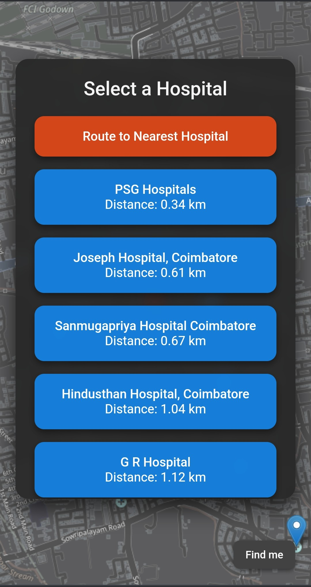
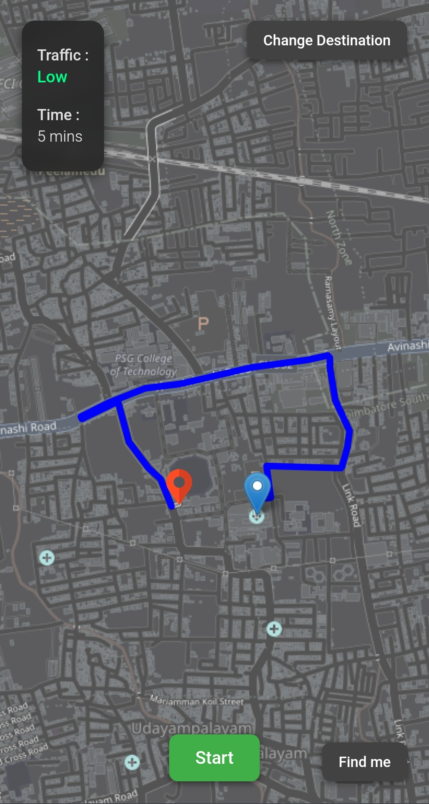
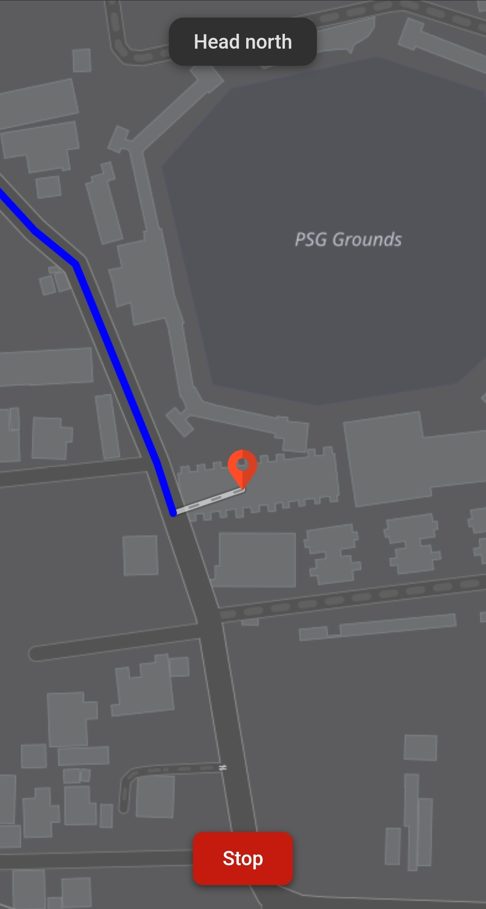

# Phanes — Smart Ambulance Routing & Nearby Hospital Finder

Phanes is a smart web app that helps ambulance drivers find the **nearest hospitals**, get **live traffic-aware directions**, and track their **real-time movement**, all within a sleek and responsive interface.

Built to support **emergency response optimization**, Phanes reduces decision time and improves navigation with intuitive UI and powerful mapping features.

**Visit the website:** [Phanes — Smart Ambulance Routing](https://phanes-ers.netlify.app)

---

## Features

- **Discover Nearby Hospitals**  
  Automatically fetches hospitals within a certain optimal radius using location data.

- **Route to Hospital**  
  Select your preferred hospital and get directions instantly or choose the nearest hospital.

- **Live Traffic Awareness**  
  Shows real-time traffic level (Low / Medium / High) with color cues.

- **ETA Calculation**  
  Estimates time of arrival based on current traffic flow.

- **Real-Time Tracking**  
  Continuously updates the ambulance location on the map as it moves.

- **Responsive & Sleek UI**  
  Clean, minimalistic, and mobile-friendly design for seamless usage on any device.

---

## Tech Stack

- **Frontend**: HTML, CSS, JavaScript  
- **Maps & Routing**: OpenStreetMaps API  
- **Geolocation & Traffic**: TomTom Traffic API, Browser Geolocation

---

## User Interface

  
  
  

